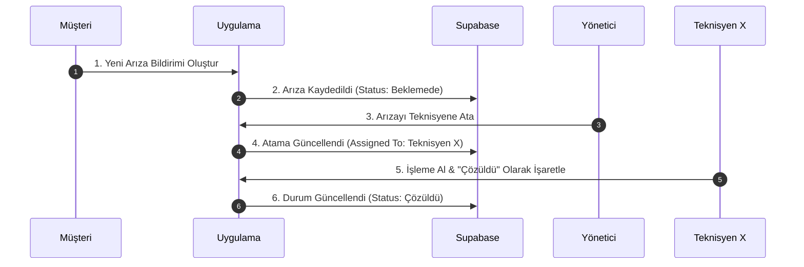

# 📋 Asansör Bakım ve Arıza Takip Sistemi (Asansor) - Kapsamlı QA & Manuel Test Planı

Bu doküman, uygulamanın tüm fonksiyonel bileşenlerini, sınır durumlarını (edge cases), çevrimdışı çalışma senaryolarını ve güvenlik yetkilerini uçtan uca test etmek için hazırlanmış **eksiksiz bir QA (Kalite Güvence) kontrol listesidir**. 

Uygulamanın prodüksiyona çıkış öncesi testlerinde bu plandaki tüm senaryoların başarıyla geçmesi gerekmektedir.

---

## 🗂️ İçindekiler
1. [🔐 Kimlik Doğrulama ve Oturum Yönetimi (Auth)](#1--kimlik-doğrulama-ve-oturum-yönetimi-auth)
2. [🌐 Offline-First ve Senkronizasyon (Sync Queue)](#2--offline-first-ve-senkronizasyon-sync-queue)
3. [👥 Rol Bazlı Arayüz ve Yetki Kontrolleri (RBAC & RLS)](#3--rol-bazlı-arayüz-ve-yetki-kontrolleri-rbac--rls)
4. [🏢 Asansör Yönetimi Ekranları](#4--asansör-yönetimi-ekranları)
5. [🚨 Arıza Raporlama ve Takip Akışı](#5--arıza-raporlama-ve-takip-akışı)
6. [🔧 Periyodik Bakım ve Form Kontrolleri](#6--periyodik-bakım-ve-form-kontrolleri)
7. [⚠️ Sınır Durumlar (Edge Cases) ve Hata Yönetimi](#7--sınır-durumlar-edge-cases-ve-hata-yönetimi)
8. [🎨 UI/UX ve Performans Testleri](#8--uiux-ve-performans-testleri)

---

## 1. 🔐 Kimlik Doğrulama ve Oturum Yönetimi (Auth)

Uygulamanın Supabase Auth entegrasyonu ve oturum güvenliği test senaryolarıdır.

| Test ID | Test Senaryosu | Beklenen Davranış | Durum (P/F) |
| :--- | :--- | :--- | :--- |
| **AUTH-01** | Geçerli bilgilerle giriş yapma | Kullanıcı doğru e-posta ve şifreyle giriş yaptığında rolüne uygun ana sayfaya yönlendirilmeli. | |
| **AUTH-02** | Hatalı şifre/e-posta denemesi | Supabase'den dönen hata mesajı ("Hatalı şifre veya e-posta") kullanıcıya kırmızı bir uyarı kartı/snackbar olarak gösterilmeli. | |
| **AUTH-03** | Boş alan doğrulama (Validation) | E-posta veya şifre alanı boş bırakıldığında "Bu alan boş bırakılamaz" uyarısı çıkmalı ve istek gönderilmemeli. | |
| **AUTH-04** | Geçersiz e-posta formatı | `test@domain` gibi geçersiz formatlarda "Geçerli bir e-posta adresi girin" uyarısı alınmalı. | |
| **AUTH-05** | Şifre sıfırlama (Password Reset) | Şifresini unutan kullanıcı e-postasını girdiğinde Supabase üzerinden şifre sıfırlama maili tetiklenmeli. | |
| **AUTH-06** | Güvenli çıkış yapma (Logout) | Çıkış butonuna basıldığında yerel oturum temizlenmeli, Hive cache sıfırlanmalı ve giriş ekranına yönlendirilmeli. | |
| **AUTH-07** | Oturumun korunması (Auto-Login) | Uygulama kapatılıp tekrar açıldığında kullanıcı oturumu aktifse şifre sormadan doğrudan ana ekrana geçmeli. | |
| **AUTH-08** | İnternet yokken ilk giriş | Cihaz çevrimdışıyken ilk kez giriş yapmaya çalışıldığında "İnternet bağlantınızı kontrol edin" uyarısı verilmeli (Çevrimdışı giriş sadece cache varsa mümkündür). | |

---

## 2. 🌐 Offline-First ve Senkronizasyon (Sync Queue)

Uygulamanın internet kesintilerinde verileri yerelde (Hive) saklama ve bağlantı kurulduğunda Supabase ile senkronize etme yeteneğinin testleridir.

> [!IMPORTANT]
> Bu bölümdeki testleri gerçekleştirmek için cihazı **Uçak Moduna** alarak veya internet bağlantısını keserek test yapınız.

| Test ID | Test Senaryosu | Beklenen Davranış | Durum (P/F) |
| :--- | :--- | :--- | :--- |
| **SYNC-01** | İnternetsiz veri ekleme (İyimser Güncelleme) | İnternet kapalıyken yeni bir arıza bildirimi yapıldığında arıza anında yerel listede "Bekliyor/Senkronize Ediliyor" ikonuyla görünmeli. | |
| **SYNC-02** | İnternetsiz veri güncelleme | İnternet kapalıyken asansör durumu değiştirildiğinde yerelde güncellenmeli, hata vermemeli. | |
| **SYNC-03** | Bağlantı geri geldiğinde otomatik tetiklenme | Cihaz internete bağlandığı an `SyncQueueService` arka planda çalışmaya başlamalı ve yereldeki işlemleri sırayla Supabase'e yüklemeli. | |
| **SYNC-04** | Başarılı senkronizasyon sonrası durum güncellemesi | Yerelde "Kuyrukta" olarak işaretlenen veriler buluta başarıyla yazıldığında yereldeki geçici durum "Senkronize edildi" olarak güncellenmeli. | |
| **SYNC-05** | Çakışma Yönetimi (Conflict Resolution - OCC) | Aynı veri hem sunucuda hem yerelde değiştirilmişse, yerel veri gönderilirken `version` kontrolü yapılmalı ve sunucu verisiyle çakışma durumunda güncel olan ezilmemeli. | |
| **SYNC-06** | Sıralı kuyruk yürütme (FIFO) | İnternet kapalıyken sırasıyla yapılan A, B, C işlemleri, internet geldiğinde yine tam olarak A -> B -> C sırasıyla veritabanına işlenmeli. | |
| **SYNC-07** | Senkronizasyon sırasında internetin tekrar kopması | Kuyruktaki 5 işlemden 2'si gönderildikten sonra internet tekrar koparsa, kalan 3 işlem kuyrukta güvenle beklemeli, veri kaybı olmamalı. | |

---

## 3. 👥 Rol Bazlı Arayüz ve Yetki Kontrolleri (RBAC & RLS)

Supabase Row Level Security (RLS) politikalarının ve arayüz yetkilendirmelerinin test senaryolarıdır.

### 👑 Yönetici (Admin) Yetkileri
- [ ] **ADMIN-01:** Sisteme yeni teknisyen hesabı tanımlayabiliyor mu?
- [ ] **ADMIN-02:** Sisteme yeni asansör ekleyip binalarla ilişkilendirebiliyor mu?
- [ ] **ADMIN-03:** Teknisyenlerin performans istatistiklerini (tamamlanan bakım, aktif arızalar) görebiliyor mu?
- [ ] **ADMIN-04:** Bir arıza kaydını belirli bir teknisyene atayabiliyor mu?
- [ ] **ADMIN-05:** Müşterilerin fatura veya servis kayıtlarını oluşturup düzenleyebiliyor mu?

### 🔧 Teknisyen (Technician) Yetkileri
- [ ] **TECH-01:** Sadece kendisine atanan bakım işlerini ve arıza çağrılarını görebiliyor mu? (Başkasına atananları görememeli).
- [ ] **TECH-02:** Bakım formundaki kontrol listesini (checklist) işaretleyip imzalayarak kaydedebiliyor mu?
- [ ] **TECH-03:** Arızayı giderdiğinde arıza durumunu "Çözüldü" olarak güncelleyebiliyor mu?
- [ ] **TECH-04:** Yönetici yetkisi gerektiren "Yeni Teknisyen Ekleme" veya "Sistem Ayarları" ekranlarına erişimi engellenmiş mi?

### 🏢 Müşteri / Bina Yöneticisi (Customer) Yetkileri
- [ ] **CUST-01:** Sadece kendi binasındaki/sorumlu olduğu asansörleri görebiliyor mu? (Farklı binaların asansörlerini listeleyememeli - RLS denetimi).
- [ ] **CUST-02:** Kendi binası için yeni bir arıza bildirimi açabiliyor mu?
- [ ] **CUST-03:** Geçmiş bakım raporlarını PDF veya liste formatında görüntüleyebiliyor mu?
- [ ] **CUST-04:** Arıza durumunu güncelleme veya bakım kaydı oluşturma gibi teknisyen/admin yetkilerine sahip mi? (Arayüzde bu butonlar gizli olmalı, API istekleri RLS tarafından reddedilmeli).

---

## 4. 🏢 Asansör Yönetimi Ekranları

Asansör tanımları, bina eşleştirmeleri ve durum izleme testleridir.

| Test ID | Test Senaryosu | Beklenen Davranış | Durum (P/F) |
| :--- | :--- | :--- | :--- |
| **ELEV-01** | Yeni Asansör Ekleme | Yönetici asansör adı, bina adı, adresi ve modelini girdiğinde asansör başarıyla kaydedilmeli. | |
| **ELEV-02** | Asansör Durumu Değiştirme | Asansör durumu "Aktif", "Bakımda", "Arızalı", "Kullanım Dışı" olarak güncellendiğinde tüm kullanıcılarda anında değişmeli. | |
| **ELEV-03** | QR Kod / Barkod ile arama | Asansöre özel üretilen QR kod taratıldığında doğrudan o asansörün detay sayfasına yönlendirmeli (Varsa). | |
| **ELEV-04** | Filtreleme ve Arama | Asansör listesinde bina adına veya durumuna göre arama/filtreleme sorunsuz çalışmalı. | |

---

## 🚨 Arıza Raporlama ve Takip Akışı

Müşterinin bildirdiği arızanın teknisyene atanması ve çözülmesi sürecidir.

- [ ] **FAULT-01:** Müşteri arıza bildirimi yaparken fotoğraf/dosya ekleyebiliyor mu?
- [ ] **FAULT-02:** Yeni arıza eklendiğinde yönetici paneline anlık bildirim (Realtime) düşüyor mu?
- [ ] **FAULT-03:** Teknisyen arızayı "İşleme Alındı" konumuna getirdiğinde müşterinin ekranında durum güncelleniyor mu?
- [ ] **FAULT-04:** Arıza kapatılırken teknisyen "Yapılan İşlemler" açıklamasını zorunlu olarak dolduruyor mu?

---

## 6. 🔧 Periyodik Bakım ve Form Kontrolleri

Bakım planlaması ve kontrol listelerinin doldurulma aşaması testleridir.

- [ ] **MAINT-01:** Yönetici ileri tarihli periyodik bakım takvimi oluşturabiliyor mu?
- [ ] **MAINT-02:** Bakım günü gelen asansör teknisyenin takviminde/ana sayfasında belirginleşiyor mu?
- [ ] **MAINT-03:** Bakım adımları (Halat kontrolü, Yağlama, Fren testi vb.) tek tek işaretlenmeden bakım formu "Tamamlandı" olarak kaydedilebiliyor mu? (İşaretlenmesi zorunlu olmalı).
- [ ] **MAINT-04:** Bakım esnasında yeni bir arıza fark edilirse, bakım ekranından çıkmadan hızlıca "Arıza Bildirimi" oluşturulabiliyor mu?

---

## 7. ⚠️ Sınır Durumlar (Edge Cases) ve Hata Yönetimi

Uygulamanın beklenmedik durumlarda çökmesini önlemek ve kararlılığı ölçmek için yapılan testlerdir.

- [ ] **EDGE-01: Büyük Boyutlu Fotoğraf Yükleme:** Arıza bildirimi yaparken 20MB+ boyutunda fotoğraf yüklenmeye çalışıldığında uygulama çökmek yerine "Dosya boyutu çok büyük" uyarısı veriyor mu?
- [ ] **EDGE-02: Oturum Aşımı (Session Timeout):** Supabase token süresi dolduğunda uygulama arka planda sessizce token'ı yeniliyor mu yoksa kullanıcıyı pat diye giriş ekranına mı atıyor? (Sessizce yenilemeli).
- [ ] **EDGE-03: Eşzamanlı Düzenleme:** İki farklı yönetici aynı anda aynı asansörün bilgilerini güncellerken son kaydeden veri bütünlüğünü bozuyor mu? (OCC kontrolü).
- [ ] **EDGE-04: Uygulamanın Zorla Kapatılması (App Kill):** `SyncQueue` senkronizasyon yaparken uygulamanın zorla kapatılması durumunda veriler bozuluyor mu? Yeniden açıldığında kuyruk kaldığı yerden devam ediyor mu?
- [ ] **EDGE-05: Hatalı Karakter Girişleri:** Arama kutularına veya metin alanlarına `' OR '1'='1` gibi SQL enjeksiyonu veya XSS riskli karakterler girildiğinde uygulama güvenli kalıyor mu?

---

## 8. 🎨 UI/UX ve Performans Testleri

- [ ] **UI-01: Karanlık Mod (Dark Mode):** Uygulama karanlık moda alındığında okunmayan metin veya kontrastı bozuk buton var mı?
- [ ] **UI-02: Dinamik Metin Boyutu:** Telefon ayarlarından yazı boyutu büyütüldüğünde taşan, kırpılan veya tıklanamayan butonlar oluşuyor mu?
- [ ] **UI-03: Geri Butonu Davranışı:** Android cihazlarda fiziksel geri butonuna basıldığında oturum açıkken giriş ekranına geri dönülüyor mu? (Dönülmemeli, uygulama içinde doğru bir şekilde geri gitmeli veya uygulamayı kapatmalı).
- [ ] **PERF-01: Büyük Veri Altında Listeleme:** Yerelde 1000+ asansör ve bakım kaydı varken listeler kaydırılırken kasma/donma (jank) yaşanıyor mu? (Lazy Loading / Pagination testi).
- [ ] **PERF-02: RAM ve Pil Tüketimi:** Uygulama arka planda açıkken veya sürekli senkronizasyon yaparken aşırı pil ve RAM tüketimi yapıyor mu?
