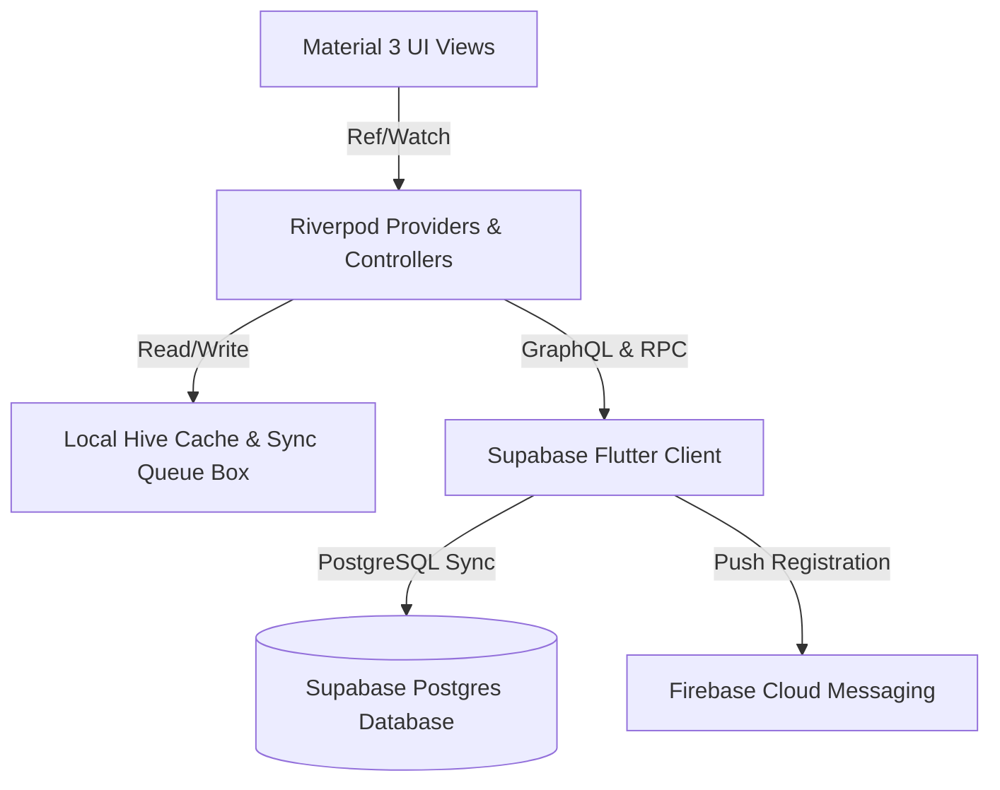
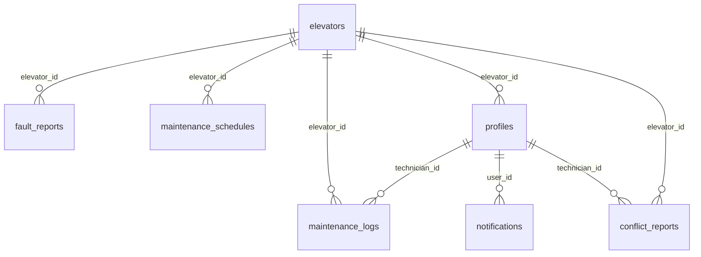
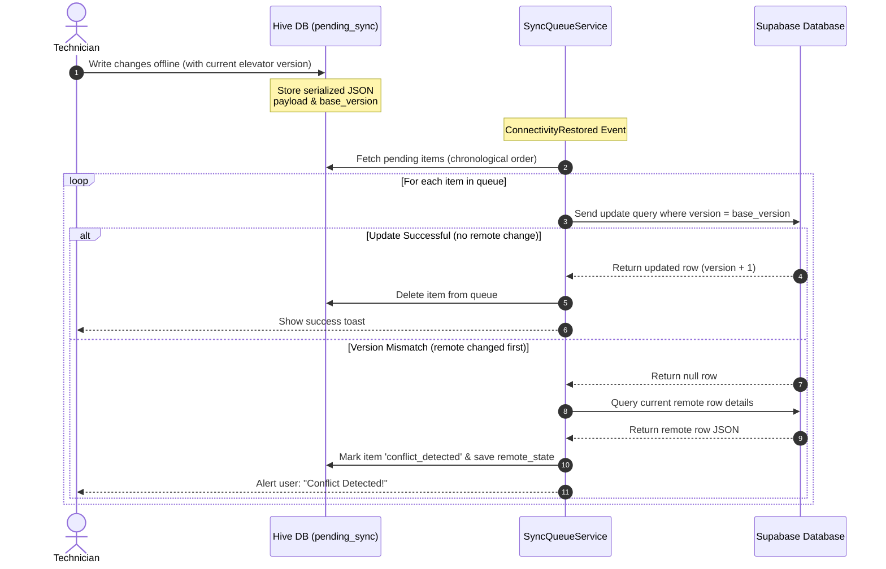
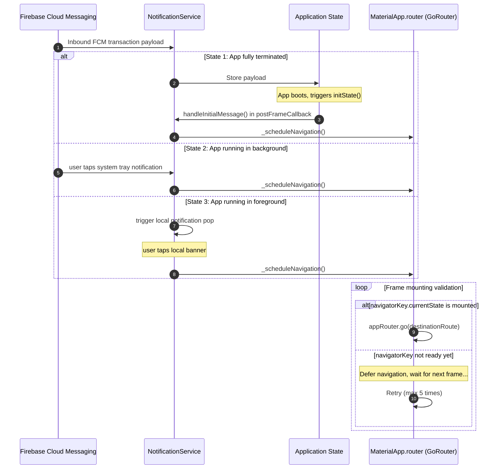

# Project Context: Asansor (Elevator Maintenance & Fault Tracking System)

This document provides a highly comprehensive, production-grade technical overview of the **Asansor** project. It is designed to act as a "single source of truth" for external AI assistants (e.g., Gemini) to immediately understand the repository architecture, database schemas, complex routing guards, optimistic offline-first conflict management, and FCM push notifications routing.

---

## 1. Project Overview & Purpose

**Asansor** is an enterprise-grade mobile application designed for elevator maintenance companies. It bridges the gap between field technicians performing periodic maintenance and legal safety inspections, building customer representatives, and office administrators managing logistics.

### Core Business Pillars
*   **Fault Reporting & Tracking:** Rapid reporting of elevator breakdowns by customers or technicians with photo uploads, fault categories (`Mekanik`, `Elektrik`, `Mahsur`), and urgency priority tiers.
*   **Periodic Maintenance Engine:** Structured log sheets with dynamic inspections, signature drawing, and image evidence mapping.
*   **Legal Certification Compliance:** Legal A-Type color tag inspections (`red`, `yellow`, `blue`, `green`, `none`) with automated annual schedule calculation.
*   **Offline-First Autonomy:** Fully operational offline database caching and serialised local queueing that plays back offline writes on reconnection.
*   **Synchronous RLS Guarding:** Custom role boundaries enforced seamlessly between GoRouter, Riverpod auth controllers, and Supabase security policies.
*   **FCM Push Routing:** Direct transactional notifications sent from Edge Functions, routed via frame-safe navigation based on application state.

---

## 2. Tech Stack & Architecture

### Mobile Client (Flutter & Dart)



*   **State Management (`flutter_riverpod` v2.6.1):** Declarative, compile-safe dependency injection and state controllers. Riverpod keeps view layouts entirely decoupled from async database network transactions.
*   **Declarative Router (`go_router` v15.1.2):** High-performance routing integrated with a global single-reference `navigatorKey` and a custom role listener to run synchronised redirects.
*   **Offline Caching (`hive_flutter` v1.1.0):** No-SQL local storage using standard JSON serialization mapped to Hive boxes. Avoids codegen/adapter coupling, allowing transparent structure evolution.
    *   `pending_sync`: Holds serialised offline write operations.
    *   `elevators_cache`: Caches active elevator master records.
    *   `tasks_cache`: Caches upcoming scheduled maintenance sheets.
*   **Legal Report Compilation (`pdf` & `printing`):** Dynamic, corporate-styled PDF generation supporting the **Latin-Extended-A** block (allowing full Turkish character compatibility: `ç ş ğ ü ö ı İ`).
*   **Primary Database Gateway (`supabase_flutter` v2.9.0):** Realtime web socket subscriptions, RESTful querying, storage bucket management, and Edge Function invocation.
*   **Connectivity Monitoring (`connectivity_plus`):** Active network state tracking that drives the automatic playback of queued offline actions.

---

## 3. Core Software Architectures

### A. Offline-First Sync & Optimistic Version Control
To manage concurrency and network dropouts in building basements or remote shafts, Asansor implements an **Optimistic Concurrency Control (OCC)** strategy combined with a **Write-Ahead Log Queue**:

1.  **Queue Injection:** When a write occurs offline, it is written to the `pending_sync` Hive box.
    *   Elevator updates include a `base_version` (the integer version loaded at the time of modification).
2.  **Playback Engine:** When connectivity is detected, `SyncQueueService.flush()` runs through pending actions chronologically.
3.  **Conflict Guard:** For `elevator_update` operations, the query runs: `.update(changes).eq('id', id).eq('version', baseVersion)`.
    *   If the database version was incremented remotely in the interim, the update returns `null`.
    *   The engine catches this, fetches the current remote state, throws a `ConflictException`, and marks the queue item as `status = 'conflict_detected'`.
4.  **Admin Resolvers:** Conflicted actions are isolated on the user dashboard. Technicians or admins have three options:
    *   **Force Update (`resolveForceUpdate`):** Fetch latest remote version, overwrite `base_version` with remote version, and re-trigger sync.
    *   **Flag Disputed (`resolveFlagDisputed`):** Write both local and remote payloads to the `conflict_reports` database table for admin arbitration, then purge from local queue.
    *   **Discard Local (`resolveDiscard`):** Purge the local modifications, keeping the remote state.

### B. Unified FCM Routing & Frame-Safe Navigation
Handling notifications when an app is terminated, in the background, or open is notoriously error-prone. Asansor implements a **3-State Frame-Safe Messaging Interface**:

1.  **State 1: Cold Start (App Terminated):**
    *   User taps a system tray notification.
    *   `NotificationService.instance.handleInitialMessage()` is called inside a `WidgetsBinding.instance.addPostFrameCallback` from the root application widget (`AsansorApp`). This ensures GoRouter has completed its initial layout before the click payload is evaluated.
2.  **State 2: Warm Start (App in Background):**
    *   `FirebaseMessaging.onMessageOpenedApp` captures the tap stream and extracts the JSON data payload.
3.  **State 3: Active State (App in Foreground):**
    *   `FirebaseMessaging.onMessage` receives the payload.
    *   A local notification is built and popped via `flutter_local_notifications` to preserve native OS alerts.
    *   `onDidReceiveNotificationResponse` catches the click response.
4.  **Post-Frame Navigation Queue:**
    *   Once a click is received in any state, the target route (e.g., `/elevator/{id}`) is sent to `_scheduleNavigation()`.
    *   If GoRouter's Navigator is not yet fully mounted, the action is deferred using a 5-frame retry loop rather than silently failing the routing.

---

## 4. Directory Structure

```text
lib/
├── core/                           # Shared system infrastructure
│   ├── constants/                  # Configuration defaults & keys
│   │   └── supabase_constants.dart # Supabase URL and anonymous token definitions
│   ├── exceptions/                 # Custom error models
│   │   └── conflict_exception.dart # Conflict details representing remote db state
│   ├── providers/                  # Shared system providers
│   │   └── connectivity_providers.dart # Net status and automatic sync triggers
│   ├── router/                     # Navigation routing & guards
│   │   └── app_router.dart         # GoRouter setup & role redirect handlers
│   ├── services/                   # Singleton systems
│   │   ├── auto_schedule_service.dart  # Technician routine path planner
│   │   ├── notification_service.dart   # FCM, local notifications & 3-state navigation
│   │   ├── pdf_service.dart        # NunitoSans Turkish legal A4 compiler
│   │   ├── read_cache_service.dart # Generic Hive-backed JSON caching layer
│   │   └── sync_queue_service.dart # Optimistic sync, OCC, and conflict resolvers
│   ├── theme/                      # Visual definitions
│   │   └── brand_theme.dart        # M3 palettes and custom typography presets
│   └── widgets/                    # Reusable stateless components
│       ├── custom_buttons.dart
│       └── info_card.dart
│
├── features/                       # Modular business domains
│   ├── admin/                      # Admin & office analytics view
│   │   ├── conficts/               # UI to review and resolve OCC conflicts
│   │   ├── models/
│   │   ├── providers/
│   │   │   ├── admin_analytics_provider.dart # MTBF & performance metrics
│   │   │   └── profile_providers.dart # Profile rosters & user updates
│   │   ├── repositories/
│   │   └── views/                  # Calendars, assignment logs, rosters
│   ├── auth/                       # User session management
│   │   ├── providers/              # AuthController and active stream bindings
│   │   ├── repositories/
│   │   └── views/                  # Elegant glassmorphic M3 sign-in interface
│   ├── customer/                   # Simplified building owner portal
│   │   └── views/                  # Elevator status & PDF report downloads
│   ├── elevator/                   # Elevator lifecycle assets
│   │   ├── models/                 # ElevatorModel with optimistic version tag
│   │   ├── views/                  # Detailed specifications, history list, and live maps
│   ├── fault/                      # Malfunction tickets
│   │   └── views/                  # Photo capture, priority triage, and resolution notes
│   └── maintenance/                # Routine periodic checkups
│       ├── models/                 # ChecklistItem, MaintenanceLogModel
│       └── views/                  # Action list checkbox grid & signature drawing pad
│
├── firebase_options.dart           # Generated FCM target bindings
└── main.dart                       # Global system bootstrapper
```

---

## 5. Backend Database Schema (Verified Real-Time)

The PostgreSQL schema inside our Supabase database (`fuwmrhahwvsouhcxycyr`) is strictly structured with foreign keys, custom user role checks, and numeric version columns to facilitate client-side OCC.



### Table Specifications

#### 1. `elevators` (Elevator Master Data)
*   `id` (`uuid`, Primary Key): Generated via `extensions.uuid_generate_v4()`.
*   `building_name` (`text`): Descriptive building moniker.
*   `address` (`text`, Nullable): Physical geolocation context.
*   `status` (`text`, Default `'Aktif'`): Primary state string.
*   `latitude` (`double precision`, Nullable): For geospatial routing.
*   `longitude` (`double precision`, Nullable): For geospatial routing.
*   `maintenance_day` (`integer`, Default `1`): Calendar day assigned for routine checks.
*   `model` (`text`, Nullable): Manufacturer model text.
*   `capacity` (`integer`, Nullable): Maximum safe load capacity.
*   `last_inspection_date` (`timestamptz`, Nullable): Date of the last legal safety audit.
*   `next_inspection_date` (`timestamptz`, Nullable): Calculated anniversary check date.
*   `inspection_status` (`USER-DEFINED enum`, Default `'none'`): Legal tag color. Values: `red`, `yellow`, `blue`, `green`, `none`.
*   `version` (`integer`, Default `1`): Incremented automatically by triggers on remote updates to validate OCC locks.

#### 2. `profiles` (User Management)
*   `id` (`uuid`, Primary Key): References `auth.users.id`.
*   `full_name` (`text`, Nullable): Human name.
*   `role` (`USER-DEFINED enum`, Default `'technician'`): Role tiers. Values: `admin`, `technician`, `customer`.
*   `phone` (`text`, Nullable): Contact number.
*   `company_name` (`text`, Nullable): Customer association parameter.
*   `elevator_id` (`uuid`, Nullable): References `elevators.id` (strictly used to lock building managers/customers to their singular machine).
*   `fcm_token` (`text`, Nullable): Cached FCM registration key for routing transactions.
*   `created_at` (`timestamptz`): Node creation date.

#### 3. `maintenance_logs` (Periodic Work Records)
*   `id` (`uuid`, Primary Key): Generated via `extensions.uuid_generate_v4()`.
*   `elevator_id` (`uuid`): References `elevators.id`.
*   `technician_id` (`uuid`, Nullable): References `profiles.id`.
*   `notes` (`text`, Nullable): General service feedback notes.
*   `is_approved` (`boolean`, Default `false`): Customer representative authorization flag.
*   `maintenance_date` (`timestamptz`, Default `now()`): Actual visit timestamp.
*   `checklist` (`jsonb`, Default `'{}'::jsonb`): List of verified items mapping criteria to boolean passes.
*   `photos` (`text[]`, Default `'{}'`): Array of asset verification URLs.
*   `signature_url` (`text`, Nullable): URL path pointing to the technician's digital signature file.
*   `customer_signature_url` (`text`, Nullable): Representative's signature.
*   `pdf_url` (`text`, Nullable): Storage path pointing directly to the compiled Turkish NunitoSans maintenance report.

#### 4. `maintenance_schedules` (Roster Planning)
*   `id` (`uuid`, Primary Key): Generated via `extensions.uuid_generate_v4()`.
*   `elevator_id` (`uuid`, Nullable): References `elevators.id`.
*   `technician_id` (`uuid`, Nullable): References `auth.users.id`.
*   `scheduled_date` (`timestamptz`): Targeted appointment date.
*   `status` (`text`, Default `'pending'`): Roster state. Values: `pending`, `completed`, `cancelled`.
*   `priority` (`text`, Default `'normal'`): Urgency tier. Values: `low`, `normal`, `high`, `emergency`.
*   `task_type` (`text`, Default `'periodic_maintenance'`): Category of schedule.
*   `created_by` (`uuid`, Default `auth.uid()`): Admin or user scheduling the event.

#### 5. `fault_reports` (Malfunction Incidents)
*   `id` (`uuid`, Primary Key): Generated via `extensions.uuid_generate_v4()`.
*   `elevator_id` (`uuid`): References `elevators.id`.
*   `description` (`text`): Narrative of the failure.
*   `photo_url` (`text`, Nullable): Uploaded file mapping.
*   `is_resolved` (`boolean`, Default `false`): Verification flag.
*   `reported_at` (`timestamptz`, Default `now()`): Timestamp.
*   `resolved_at` (`timestamptz`, Nullable): Timestamp.
*   `resolution_notes` (`text`, Nullable): Context explaining how the failure was rectified.
*   `fault_type` (`text`, Nullable): Technical taxonomy.
*   `priority` (`text`, Nullable): Triage rating.

#### 6. `notifications` (In-App Notification Ledger)
*   `id` (`uuid`, Primary Key): Generated via `gen_random_uuid()`.
*   `user_id` (`uuid`): References `profiles.id`.
*   `title` (`text`): Notification header.
*   `body` (`text`): Notification narrative.
*   `data_payload` (`jsonb`, Nullable): Key-value parameters parsed on application navigation.
*   `is_read` (`boolean`, Default `false`): State parameter.
*   `created_at` (`timestamptz`): Node creation date.

#### 7. `conflict_reports` (OCC Resolution Logs)
*   `id` (`uuid`, Primary Key): Generated via `gen_random_uuid()`.
*   `elevator_id` (`uuid`): References `elevators.id`.
*   `technician_id` (`uuid`): References `auth.users.id`.
*   `local_payload` (`jsonb`): The technician's modified payload that failed to write.
*   `remote_payload` (`jsonb`): The remote state that existed in Supabase at conflict detection.
*   `status` (`text`, Default `'pending'`): Verification parameter.
*   `created_at` (`timestamptz`): OCC creation date.

#### 8. `checklist_items` (Checklist Templates)
*   `id` (`uuid`, Primary Key): Generated via `gen_random_uuid()`.
*   `label` (`text`): Checklist criteria (e.g. "Fren balataları kontrolü").
*   `description` (`text`, Nullable): Informative guideline.
*   `is_active` (`boolean`, Default `true`): Deletion bypass.

---

## 6. Visual System Architectures

### A. Offline-First Synchronization & Concurrency Resolution Flow



### B. Dynamic 3-State Frame-Safe Push Routing



---

## 7. Feature Matrix

Our implementation roster is divided into robust production modules and upcoming operational tiers:

| Component | Status | Technical Details / Dependencies | Description |
| :--- | :--- | :--- | :--- |
| **Glassmorphic Authentication** | **Complete** | Riverpod `authControllerProvider`, Supabase Auth | Safe sign-in with instant secure caching of sessions and role mapping before frame render. |
| **Optimistic Sync Engine** | **Complete** | Hive `pending_sync`, `SyncQueueService` | Read-ahead/write-behind offline architecture managing OCC version mismatch and disputed arbitrations. |
| **NunitoSans Turkish PDF Compiler** | **Complete** | `pdf_service.dart`, `printing` (NunitoSans CDN cache) | Direct creation of legally compliant A4 reports containing signature grids and photo attachments. |
| **FCM 3-State Post-Frame Guard** | **Complete** | Firebase Cloud Messaging, `NotificationService` | Resilient post-frame navigation utilizing structured retries to prevent GoRouter frame drops. |
| **Interactive Routing & Dispatch** | **Complete** | GoRouter, `appRouter` with role updates | Multi-role authorization locking technicians to calendar listings, admins to analytics, and customers to specific elevators. |
| **Legal Inspections & History** | **Complete** | `public.inspection_history`, custom enums | Stores historical safety audits using color-coded inspection tags (`red` / `yellow` / `blue` / `green`). |
| **OCC Conflict Arbitrator** | **Complete** | `public.conflict_reports` | Admin control panel where conflict resolution logs can be verified and local vs remote data manually combined. |
| **Telemetry & Sensor Feed** | **Pending** | WebSockets, simulated hardware hooks | Wire up active IoT telemetry feeds (currently driven by mock timers in the view model layer). |
| **Advanced Maintenance Metrics** | **Pending** | Riverpod analytics, Supabase RPC functions | Aggregates technician efficiency indices, predictive maintenance alerts, and MTBF computations. |
| **Dynamic Checklist Configurator**| **Complete** | `public.checklist_items` edit panels | Administrative panels enabling the design of checklist templates in real-time without modifying client source files. |
| **Native Localization (tr/en/de)**| **Pending** | `flutter_localizations` bundle mappings | Provide direct support for English and German alongside the core Turkish client UI. |
